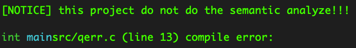
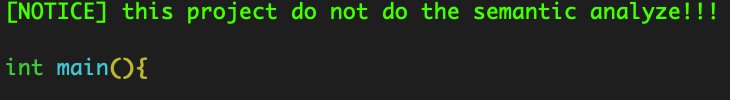
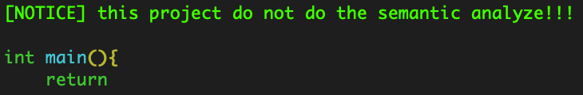
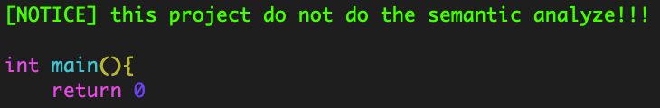
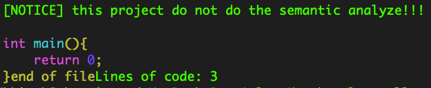
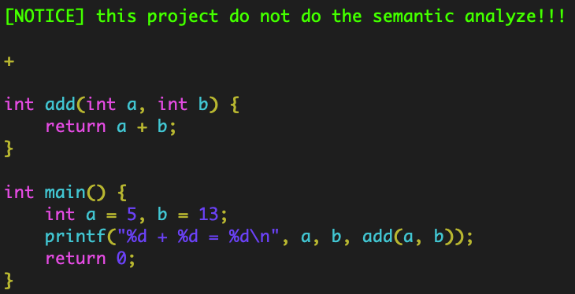
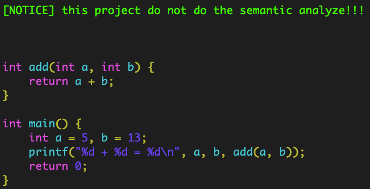

# lex

This project is used to highlight c programming language syntax

## Compile

```shell
make all
```

## Start

```shell
make check
```

## clean
```shell
make clean
```

## Development record

### Parse space


### Parse parentheses


### Parse `return`


### Parse immediate


### Parse semicolon and end of file


### Parse string


### Fix the preprocessor bug
