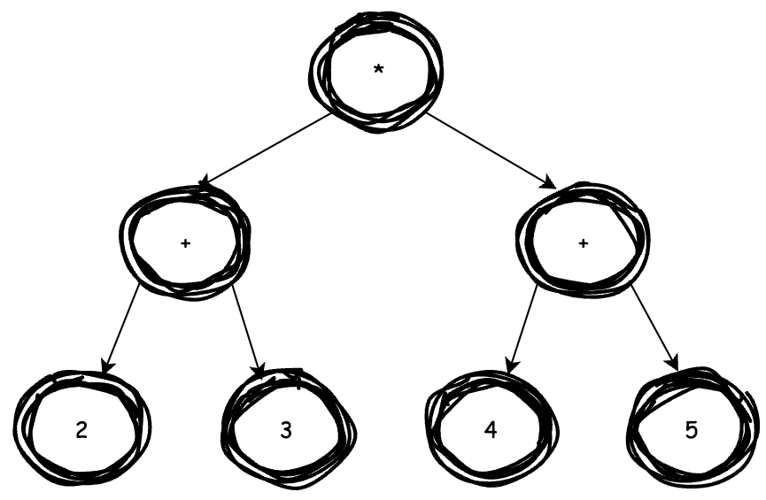

# Abstract Syntax Tree

## Purpose
We are going to use an AST to store each expression that we recognise so that, later on, we can traverse it recursively to calculate the final value of the expression. We do want to deal with the precedence of the maths operators. Here is an example.

Consider the expression `2 * 3 + 4 * 5`. Now, multiplication has higher precedence that addition. Therefore, we want to bind the multiplication operands together and perform these operations before we do the addition.



## Design
```c
struct ast_node {
    int opcode;
    int integer_value;
    struct ast_node *left;
    struct ast_node *right;
};
```
