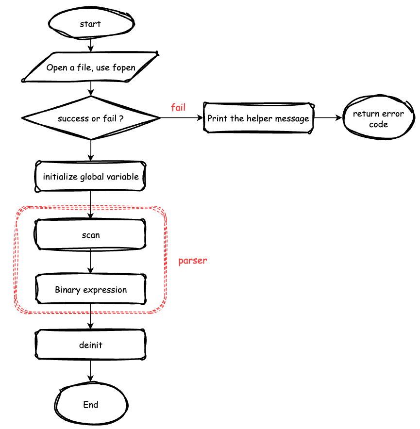
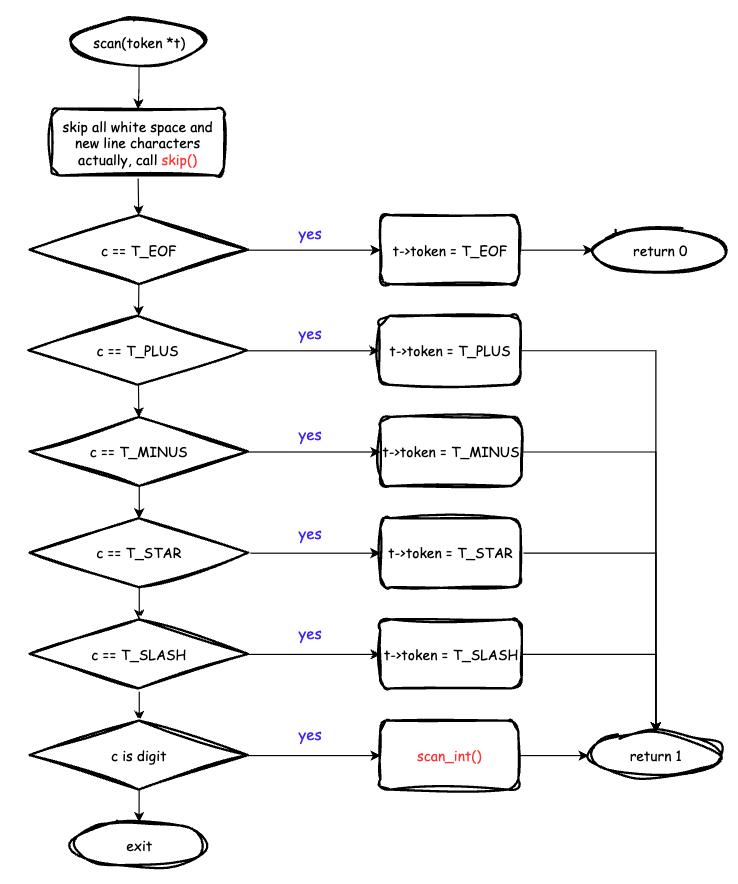
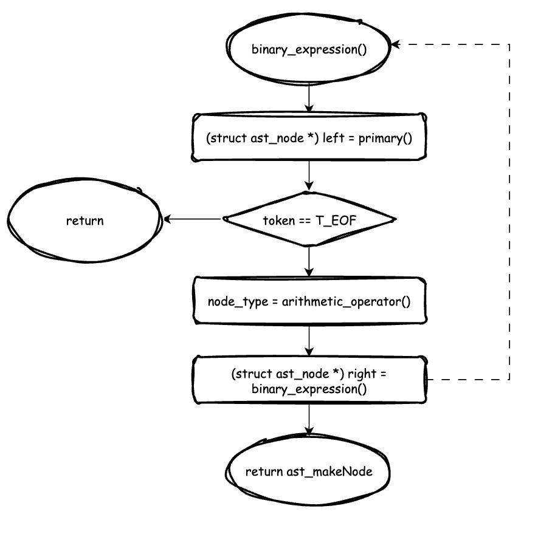

# Code flow

This document is used to record the code flow



There are several steps for the parser:
1. Open a file
2. Initialize global variable
3. Scan the token
4. Parse the binary expression

Let's start from step 3
```c
int scan(struct token *t) {
    int c;

    c = skip();

    switch(c) {
        case EOF:
            t->token = T_EOF;
            return 0;
        case '+':
            t->token = T_PLUS;
            break;
        case '-':
            t->token = T_MINUS;
            break;
        case '*':
            t->token = T_STAR;
            break;
        case '/':
            t->token = T_SLASH;
            break;
        default:
            if(isdigit(c)) {
                t->integer_value = scan_int(c);
                t->token = T_INT_LITERAL;
                break;
            }

            printf("Unrecognised character %c on line %d\n", c, line);
            exit(1);
    }

    return 1;
}
```


Where, the `skip` function is really simple, that is, while loop to skip the white space character.

and there is another function `scan_int`, which is used to parse the digital token and convert to a variable.

However, if the last token is not digit, it will put back to global variable `put_back`. when we call `next()` to get the next token, it will check the global variable `put_back` is empty. if it is empty, it will call `fgetc` to get the next character from the file, if not, it will get the character from `put_back` directly

```c
static int scan_int(int c) {
    int k, v = 0;

    /* string token to integer */
    while((k = character_position("0123456789", c)) >= 0) {
        v = v * 10 + k;
        c = next();
    }

    /* When hit a non-integer value, put it back 
     * here, the case is '+', '-', '*', '/'
     * and this should be assign to a global variable
     * so that the `next` function
     */
    putback(c);

    return v;
}
```

In step 4, we will implement the binary expression parser.
```c
struct ast_node *binary_expression(void) {
    struct ast_node *left, *right;
    int node_type;

    /* get the integer literal on the left
     * fetch the next token at the same time
     */
    left = primary();

    /* `primary` may meet T_EOF.
     * if no token left, return the left node
     */
    if(token.token == T_EOF)
        return left;

    /* convert the token into a node type */
    node_type = arithmetic_operator(token.token);

    /* get the next token in */
    scan(&token);

    right = binary_expression();

    return ast_makeNode(node_type, 0, left, right);
}
```
