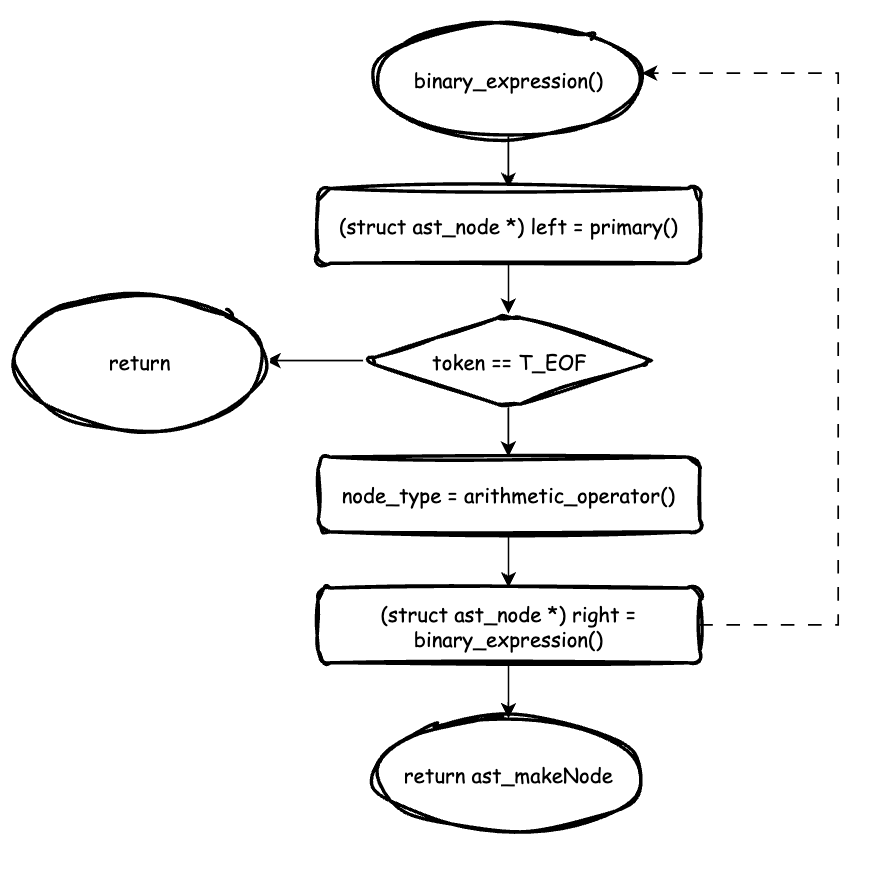

# Syntax

In this repo, we will use [BNF](https://en.wikipedia.org/wiki/Backus%E2%80%93Naur_form) to dealing with our programming language.

> Current support syntax: `+`, `-`, `*`, `/`

## syntax
```txt
<expression> := <T_INTEGER_LITERAL> |
                <expression><arithmetic_operator><expression>
```

where, `<arithmetic_operator>` is defined as follow:
```txt
<arithmetic_operator> := <T_PLUS> | <T_MINUS> | <T_STAR> | <T_SLASH>
```

and `T_INTEGER_LITERAL` is number we declare in a variable.

Thus, how do you implement this in our program?

The answer is, `recursive` and [`abstract syntax tree (ast)`](abstract_syntax_tree.md).

The first step is pesudo code for the binary expression
```
func expression
    1. scan and check the first token is a number, or return error
    2. if the token is the end, return or call expression()
```

### Recursion
There is a recursion flow for `2 + 3 - 5 <T_EOF>`
```
expression 0:
    1. get the token 2, it is a number
    2. get the token +, it is not T_EOF, call expression()

    expression 1:
        1. get the token 3, it is a number
        2. get the token -, it is not T_EOF, call expression()

        expression 2:
            1. get the token 5, it is a number
            2. get the token T_EOF, return
        return from expression 2

    return from expression 1
    
return from expression 0
```

### Recursion + AST (First Version)

There is a flow chart for recursion + ast first version implementation



In this implementation, there is a BUG!

Let's see an example `2 * 3 + 4 * 5`

which expect


However, we get


The expected result was 26, but it became 46. The reason is precedence! We DO NOT consider any precedence for any arithmetic operator.

### Solution 1: Precedence

> We need to rewrite the expression! note that, there is no differentiation between four maths operators!

There are (at least) two ways of doing this:

1. Making the operator precedence explicit in the language's grammar
2. Influencing the existing parser with an operator precedence table

Let's make the grammer different:

```txt
<expression>:=<additive expression>
```
where `<additive expression>` is defined as follows:
```txt
<additive expression> := <multiplicative expression> |
                         <additive expression><T_PLUS><additive expression> |
                         <additive expression><T_MINUS><additive expression>
```
and `<multiplicative expression>` is defined as follows:
```txt
<multiplicative expression> := <T_INTEGER_LITERAL> | 
                               <T_INTEGER_LITERAL><T_STAR><multiplicative expression> |
                               <T_INTEGER_LITERAL><T_SLASH><multiplicative expression>
```

Here, let's build a tree step by step, same case
```
2 * 3 + 4 * 5
```
```c
struct ast_node *additive_expression(void) {
    ...
    /*get the token 2 */
    left = primary();

    /* after primary, token = * */

    while(1) {
        ...
    }
}
```
Thus, currently, the tree node is


and 
```c
struct ast_node *additive_expression(void) {
    ...
    /* token_type = '*' */
    token_type = token.token;
    while(1) {
        scan(&token);
        /* token = 3 */

        right = multiplicative_expression();
        {          
            left = primary();
            token_type = token.token;
            /* make a ast node 3 and scan */
            /* now token is +, token_type = + */
            ...
            return left;
        }
    }
}
```

```c
struct ast_node *additive_expression(void) {
    ...
    /* token_type = '*' */
    token_type = token.token;
    while(1) {
        scan(&token);
        /* token = 3 */

        right = multiplicative_expression();
        left = ast_makeNode(arithmetic_operator(token_type), 0, left, right);
    }
}
```

```c
struct ast_node *additive_expression(void) {
    ...
    while(1) {
        scan(&token);
        right = multiplicative_expression();
        left = ast_makeNode(arithmetic_operator(token_type), 0, left, right);

        /* token_type = + */
        token_type = token.token;
    }
}
```
then do the next loop, scan token '4' and do the `multiplcative_expression`

```c
struct ast_node *additive_expression(void) {
    ...
    while(1) {
        scan(&token);
        right = multiplicative_expression();
        {
            struct ast_node *left, *right;
            int token_type;
            left = primary();
            /* make token 4 to ast node and current token is * */

            token_type = token.token;
            /* current token_type is * */
            
            while(token_type == T_STAR || token_type == T_SLASH) {
                scan(&token);
                right = primary();
                /* make token 5 to ast node and current token is T_EOF */

                left = ast_makeNode(arithmetic_operator(token_type), 0, left, right);
                /* make a ast node with left and right */

                token_type = token.token;
                if(token_type == T_EOF) /* break now */
                    break;
            }

            return left;
        }

        /* combine left tree and right tree */
        left = ast_makeNode(arithmetic_operator(token_type), 0, left, right);

        /* token_type = + */
        token_type = token.token;
    }
}
```


Combine left and right


Complete

### Solution 2: [Pratt parsing](https://en.wikipedia.org/wiki/Operator-precedence_parser#Pratt_parsing)

> Reference: [Pratt Parsers: Expression Parsing Made Easy](https://journal.stuffwithstuff.com/2011/03/19/pratt-parsers-expression-parsing-made-easy/)