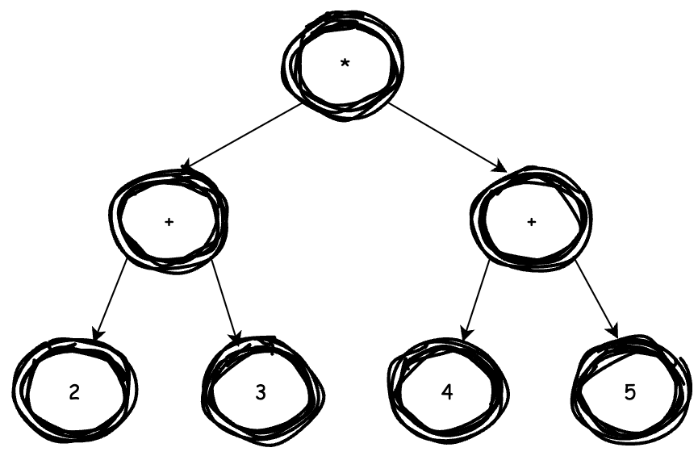

# Syntax

In this repo, we will use [BNF](https://en.wikipedia.org/wiki/Backus%E2%80%93Naur_form) to dealing with our programming language.

> Current support syntax: `+`, `-`, `*`, `/`

## syntax
```txt
<expression> := <T_INTEGER_LITERAL> |
                <expression> <arithmetic_operator> <expression>
```

where, `<arithmetic_operator>` is defined as follow:
```txt
<arithmetic_operator> := <T_PLUS> | <T_MINUS> | <T_STAR> | <T_SLASH>
```

and `T_INTEGER_LITERAL` is number we declare in a variable.

Thus, how do you implement this in our program?

The answer is, `recursive` and [`abstract syntax tree (ast)`](abstract_syntax_tree.md).

The first step is pesudo code for the binary expression
```
func expression
    1. scan and check the first token is a number, or return error
    2. if the token is the end, return or call expression()
```

### Recursion
There is a recursion flow for `2 + 3 - 5 <T_EOF>`
```
expression 0:
    1. get the token 2, it is a number
    2. get the token +, it is not T_EOF, call expression()

    expression 1:
        1. get the token 3, it is a number
        2. get the token -, it is not T_EOF, call expression()

        expression 2:
            1. get the token 5, it is a number
            2. get the token T_EOF, return
        return from expression 2

    return from expression 1
    
return from expression 0
```

### Recursion + AST (First Version)

There is a flow chart for recursion + ast first version implementation


In this implementation, there is a BUG!

Let's see an example `2 * 3 + 4 * 5`

which expect



However, we get


The expected result was 26, but it became 46. The reason is precedence! We DO NOT consider any precedence for any arithmetic operator.